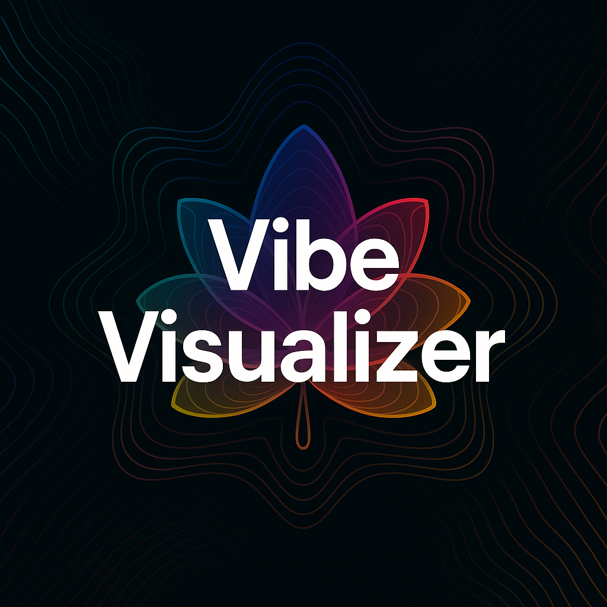

# 🎧 Vibe Visualizer

 

> A real-time, microphone-powered, trippy shape visualizer built with p5.js.  
> Turn sound into psychedelic, dynamic, ever-morphing shapes and explosions.

🔗 **Live Demo:** [https://pooyanasiri.github.io/vibe-visualizer/](https://pooyanasiri.github.io/vibe-visualizer/)


## 🚀 Features

- 🎙️ **Live microphone input** (requires user interaction to activate)
- 🌀 **Organic evolving shapes** driven by audio level
- 🌈 **Dynamic color shifting** using HSB mode
- 💥 **Reactive “bombs”** triggered by volume spikes
- 🔊 **Live volume meter** display
- 💻 Runs entirely in the browser – no install required

---

## 🧠 How It Works

- Uses [p5.js](https://p5js.org/) and [p5.sound](https://p5js.org/reference/#/libraries/p5.sound)
- Shapes are dynamically generated based on:
  - Lobe count
  - Radius
  - Wave strength
  - Rotation speed
  - Color hue offset
- Volume spikes trigger randomized "bomb" effects
- All parameters smoothly interpolate over time to create flowy visuals

---

## 🛠️ Local Development

You can run this project locally without needing Node.js or npm:

```bash
# 1. Clone the repo
git clone https://github.com/PooyaNasiri/vibe-visualizer.git
cd vibe-visualizer

# 2. Start a simple web server
python -m http.server
```

Then open [http://localhost:8000](http://localhost:8000) in your browser.

> ⚠️ Browsers block mic access on `file://` URLs – you need to serve it over `http://` or `https://`.

---

## 📦 Deployment

This site is hosted using **GitHub Pages** from the `main` branch root.

To redeploy:
- Push changes to `main`
- Make sure GitHub Pages is enabled (`Settings > Pages > Source: main / (root)`)
- Include a `.nojekyll` file to avoid blocked assets

---

## 📄 License

MIT — feel free to remix or build upon it.

---

## ✨ Credits

Made with ❤️ and 🎵 by [@PooyaNasiri](https://github.com/PooyaNasiri) using [p5.js](https://p5js.org/)
